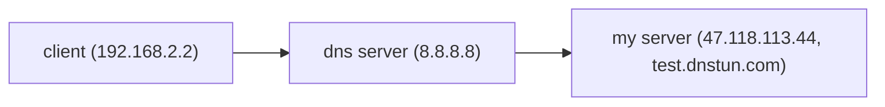

# DNSTUN

## INTRODUCTION

Dnstun is a cross-platform C++ DNS tunneling static library that enables reliable data transmission over the DNS protocol, similar to TCP, facilitating bypassing firewall rules.




## BUILD

```bash
cd dnsTun
mkdir build
cd build
cmake ..
cd build
make
```

### result：

`dnsTunTest`： the executable file of test the code  

`libdnsTun.a`: static library, the head files is in `include`


## USAGE

### 1. DnsClientChannel

The `ucsmq::DnsClientChannel` class provides a DNS-based communication channel, similar to a TCP client socket.

```c++
//path: include/DnsClientChannel.h, namespace: ucsmq
class DnsClientChannel {
    //...
    public:
    	DnsClientChannel(const SA_IN& remoteAddr_,//dns server,such as 8.8.8.8
                         SA_IN& localAddr_,//the local address to bind, if you ues default value, choose another constructor.
                         const char* myDomain_,//the domain of the server receiving message, where the DnsServerChannel is bound.
                         const std::string& userId_//user id, like test_user. The id which is not on the whitelist can not connect to the server.
                        );
    
        DnsClientChannel(const SA_IN& remoteAddr_,
                         const char* myDomain_,
                         const std::string& userId_
                        );
 //connect to the server, timeout<= 0: no timeout ;return 1:success, -1:failure
        int open(int timeout=NO_TIMEOUT);
 //close channel. If DnsClientChannel leaves its scope, it will be automatically destroyed as well.
        void close();
    
 //write and read,similar to the usage of tcp client socket. return <0: error, >=0: the size (BYTES) written or read.
        ssize_t write(const void* buf, size_t len);
        ssize_t read(void *dst, int timeout=0);
        ssize_t read(Bytes& dst,int timeout=0);
        ssize_t write(const Bytes& src);
        bool noConnErr();
};


//generete SA_IN
SA_IN inetAddr(const char* addrStr,unsigned short port);
//eg: 
SA_IN addr = inetAddr("8.8.8.8",53)

```


### 2.DnsServerChannel

The `ucsmq:DnsServerChannel` class represents a DNS server that accepts client connections, similar to the `acceptor` in tcp

```c++
//UserWhiteList represents the accessible users. If the whitelist is empty, all users can access it
struct User{
        std::string id;
    };
using UserWhiteList = std::map<std::string,User>;

//path: include/DnsServerChannel.h, namespace: ucsmq
class DnsServerChannel {
    public:
        DnsServerChannel(SA_IN& localAddr_,//the address to bindon server
                         const char* myDomain_,//the domain of server receiving messages
                         const UserWhiteList& whiteList_ = UserWhiteList()//By default, all users can access it
                        );
//once opend, DnsServerChannel is ready to accept connections from clints.return -1: failure
        int open();
//stop accepting. Remember close it manually before leaving its scope
        void close();
//block and wait for the connections from clients, similar to accept(...) in tcp listener
    	using ClientConnectionPtr = std::shared_ptr<ClientConnection>;
        ClientConnectionPtr accept();
    };
```

### 3. ClientConnection

The `ucsmq::ClientConnectionn` is like client socket in tcp. Its constructor and open() are not available and you can only create it by calling DnsServerChannel::accept().

```c++
//path: include/DnsServerChannel.h, namespace: ucsmq
class ClientConnection {
    public:
        void close();
        bool noConnErr();
        ssize_t read(void *dst, int timeout=0);
        ssize_t write(const void* src,size_t len);
        ssize_t read(Bytes& dst,int timeout=0);
        ssize_t write(const Bytes& src);
    
    
    //do not use them, althouth they are public! 
    	ClientConnection(int sockfd_,session_id_t sessionId_,const User& user_,const std::shared_ptr<ConnectionManager>& manager_,std::atomic<int>* err_);
        void handleIdle();
        void closeBuffer();
    	void open();
    };
```


