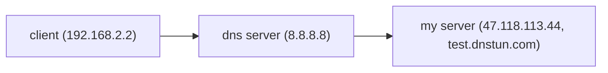

# DNSTUN

## INTRODUCTION

Dnstun is a cross-platform C++ DNS tunneling static library that enables reliable data transmission over the DNS protocol, similar to TCP, facilitating bypassing firewall rules. The data will be encoded into the domain name of the DNS query, forwarded by the DNS server in the public network, and arrive at our own server. The server's response will also be encoded into the DNS response and arrive at the client.



## SIMPLE EXAMPLE

Assume that the device `192.168.2.2` behind the firewall needs to communicate with the server `47.118.113.44`. You need to have a domain name such as `dnstun.com`, add an ns record to it, and ensure that all queries for `tun.dnstun.com` and its subdomains are delivered to `47.118.113.44` for processing. Then run `DnsServerChannel` on the server and `DnsClientChannel` on the client, and the server will receive the message.

```c++
#include <cassert>
#include "DnsClientChannel.h"
#include <functional>
#include <memory>
#include <iostream>
#include "DnsServerChannel.h"

using namespace ucsmq;
using namespace std;

const char* myDomain = "test.dnstun.com";
void client(){
    SA_IN dnsAddr = inetAddr("8.8.8.8",53);
    const char* userId = "testUser";
    DnsClientChannel dcc(dnsAddr,myDomain,userId);
    if(dcc.open(3000)<0){
        cerr<<"fail to connect to the server or timeout 3000s"<<endl;
        cerr<<getLastErrorMessage()<<endl;//path include/net.h
        exit(1);
    }
    const char* m1 = "hello server";
    dcc.write(m1,strlen(m1));
    Bytes resp;
    ssize_t n = dcc.read(resp);
    if(n < 0){
        cerr<<"fail to receive"<<endl;
    }else{
        cout<<(string)resp;
    }
    //optional, dcc will be closed after leaving its scope
    dcc.close();
}

void server(){
    SA_IN addr = inetAddr("47.118.113.44",53);
    //only "testUser" can connect
    UserWhiteList li = {"testUser",{"testUser"}};
    DnsServerChannel dsc(addr,myDomain,li);
    while(true){
        ClientConnectionPtr conn = dsc.accept();
        if(conn==nullptr) continue;
        
        auto f = [conn](){
        	Bytes m1;
            auto n  = conn->read(m1);
            if(n<0){
                cerr<<"fail to receive"<<endl;
            }else{
                cout << (string)m1;
            }
            const char* resp = "hello client";
            conn->write(resp,strlen(resp));
            //optional
            conn->close();
        };
        std::thread th(f);
        th.detach();
    }
    dsc.close();
}
```


## BUILD

```bash
cd dnsTun
mkdir build
cd build
cmake ..
make
```

### result：

`dnsTunTest`： the executable file of test the code  

`libdnsTun.a`: static library, the head files is in `include`


## PROJECT STRUCTURE

```shell
├── include
│   ├── aes.h
│   ├── BlockingQueue.hpp
│   ├── DnsClientChannel.h #for client
│   ├── DnsServerChannel.h #for server
│   ├── Log.h #log
│   ├── net.h
│   ├── Packet.h
│   └── udp.h
├── src
│   ├── lib #Define various utility functions
│   ├── net #Cross-platform udp communication functions
│   └── protocol #Functions that handle DNS protocols
└── test
    ├── CMakeLists.txt
    ├── DiscardClient.h
    ├── EchoClient.hpp
    ├── EchoServer.hpp
    ├── testDns.cpp
    ├── testDns.h
    ├── test_main.cpp
    └── TimeServer.hpp
```


## USAGE

### 1. DnsClientChannel

The `ucsmq::DnsClientChannel` class provides a DNS-based communication channel, similar to a TCP client socket.

```c++
//path: include/DnsClientChannel.h, namespace: ucsmq
class DnsClientChannel {
    //...
    public:
    	DnsClientChannel(const SA_IN& remoteAddr_,//dns server,such as 8.8.8.8
                         SA_IN& localAddr_,//the local address to bind, if you ues default value, choose another constructor.
                         const char* myDomain_,//the domain of the server receiving message, where the DnsServerChannel is bound.
                         const std::string& userId_//user id, like test_user. The id which is not on the whitelist can not connect to the server.
                        );
    
        DnsClientChannel(const SA_IN& remoteAddr_,
                         const char* myDomain_,
                         const std::string& userId_
                        );
 //connect to the server, timeout<= 0: no timeout ;return 1:success, -1:failure
        int open(int timeout=NO_TIMEOUT);
 //close channel. If DnsClientChannel leaves its scope, it will be automatically destroyed as well.
        void close();
    
 //write and read,similar to the usage of tcp client socket. return <0: error, >=0: the size (BYTES) written or read.
        ssize_t write(const void* buf, size_t len);
    	ssize_t write(const Bytes& src);
//make sure the buffer of dst is enough, or another read() is recommended
        ssize_t read(void *dst, int timeout=0);
//safe read
        ssize_t read(Bytes& dst,int timeout=0);        
        bool noConnErr();
};


//generete SA_IN
SA_IN inetAddr(const char* addrStr,unsigned short port);
//eg: 
SA_IN addr = inetAddr("8.8.8.8",53)

```

- It will continuously send heartbeat packets to the server. If the network is disconnected or timed out, it will not be able to send or receive data again.

- When using ssize_t write(const void* buf, size_t len), ensure the buffer is large enough.

- After calling `close()`, the blocked `read()` function will return immediately and no new data can be received.

- Cannot be copied or moved

  

### 2.DnsServerChannel

The `ucsmq:DnsServerChannel` class represents a DNS server that accepts client connections, similar to the `acceptor` in tcp

```c++
//UserWhiteList represents the accessible users. If the whitelist is empty, all users can access it
struct User{
        std::string id;
    };
using UserWhiteList = std::map<std::string,User>;

//path: include/DnsServerChannel.h, namespace: ucsmq
class DnsServerChannel {
    public:
        DnsServerChannel(SA_IN& localAddr_,//the address to bindon server
                         const char* myDomain_,//the domain of server receiving messages
                         const UserWhiteList& whiteList_ = UserWhiteList()//By default, all users can access it
                        );
//once opend, DnsServerChannel is ready to accept connections from clints.return -1: failure
        int open();
//stop accepting. Remember close it manually before leaving its scope
        void close();
//block and wait for the connections from clients, similar to accept(...) in tcp listener
    	using ClientConnectionPtr = std::shared_ptr<ClientConnection>;
        ClientConnectionPtr accept();
 };
```

- After calling `close()`, it will not be able to accept new connections. All related `ClientConnection` will be unable to read or write and the blocked `read()` will return. So make sure all `ClientConnection` are closed before calling
- Cannot be copied or moved


### 3. ClientConnection

The `ucsmq::ClientConnectionn` is like client socket in tcp. Its constructor and open() are not available and you can only create it by calling DnsServerChannel::accept().

```c++
//path: include/DnsServerChannel.h, namespace: ucsmq
class ClientConnection {
    public:
    //optional, it will be closed atomatically when leaving the scope
        void close();
        bool noConnErr();
        ssize_t read(void *dst, int timeout=0);
        ssize_t write(const void* src,size_t len);
        ssize_t read(Bytes& dst,int timeout=0);
        ssize_t write(const Bytes& src);
    
    //do not use it, althouth it is public! 
    	ClientConnection(int sockfd_,session_id_t sessionId_,const User& user_,const std::shared_ptr<ConnectionManager>& manager_,std::atomic<int>* err_);
    };
```

- After calling `close()`, other `ClientConnection`s are not affected. A blocking `read()` will return immediately.
- Do not create it manually through the constructor. And it can only be accessed through the smart pointer `ClientConnectionPtr`
- Cannot be copied or moved


### 4. Bytes

`uscmq:Bytes` is a memory-safe, simple data structure used to wrap `unsigned char*`

```c++
//not necessary include its headfile manully
struct Bytes{
        uint8_t *data;
        size_t size;
     //constructors
        Bytes() : data(nullptr) ,size(0) {}
        Bytes(size_t size_);
        Bytes(const void *data_,size_t size_);
        Bytes(const char* cstr);
        Bytes(const std::string& str);
     
     //important functioons
     	Bytes& operator+=(const Bytes& other);//concat 2 Bytes
     	std::string hexStr() const;
     	operator std::string () const;//convert into std::string
            
   
     //destructor
     	~Bytes(){
            delete[] data;
            data= nullptr;
            size=0;
        }
 }
```

### 


